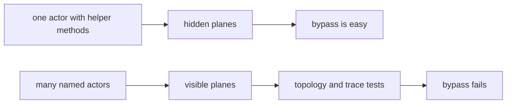
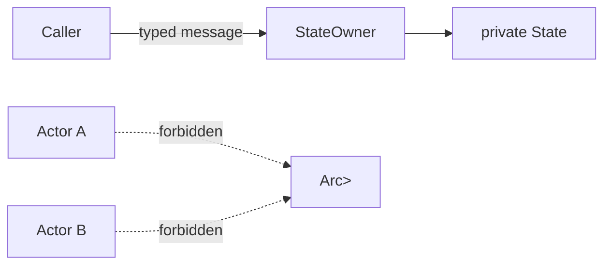
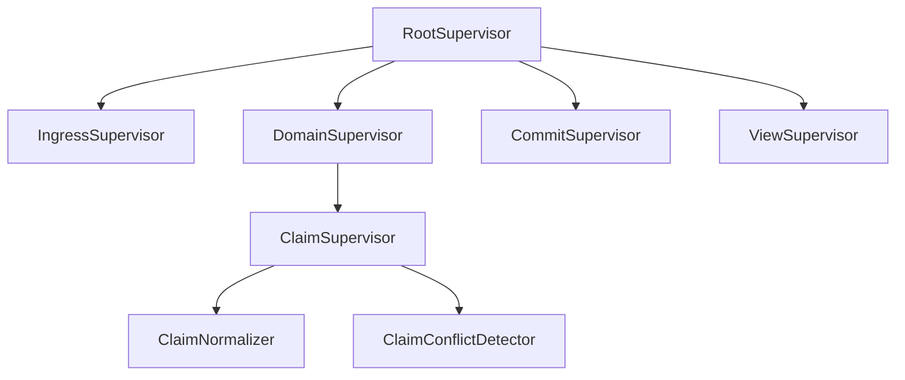
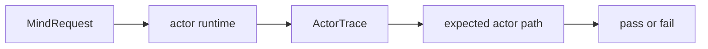

# Skill — actor systems

## What this skill is for

Use this skill whenever a component is a daemon, service, runtime,
router, state engine, watcher, delivery engine, database owner, or
other long-lived system with concurrent or ordered behavior.

The workspace uses actors not mainly because actors are fast, but
because actor boundaries force correctness in thinking. An actor
turns a vague step into a noun with state, a mailbox, failure
semantics, and an observable trace. That pressure matters in an
agent-written codebase: an agent can hide a missing phase inside a
helper method, but it is much harder to fake an actor topology,
typed messages, and trace witnesses.

The Rust runtime default is `kameo` 0.20 — see `skills/kameo.md` for
usage. Its native shape (`Self` IS the actor; `type Args = Self`;
per-kind `Message<T>` impls; declarative supervision) agrees with
the rules below. A component may have many actors; it still has one
actor library: `kameo`. Do not introduce a second actor library or
wrapper trait layer, and do not design a `persona-actor` /
`workspace-actor` wrapper crate or trait, unless the psyche
explicitly asks for a new actor abstraction.

## Core rule

**Actors all the way down.**

Every non-trivial logical plane deserves an actor. Smallness is not
an objection; triviality is. A plane is actor-shaped when all three
are true:

- it has a typed domain name, not just a verb on existing data
- it has a failure mode callers act on
- it can be tested independently with typed synthetic input

`ClaimConflict`, `IdMint`, `SemaCommit`, `FocusObservation`,
`PromptGuard`, and `ReplyShape` are actors. "Strip trailing slash"
is a method on the actor that owns path normalization.

If the plane owns state, transforms a request, validates authority,
decides legality, mints identity or time, performs IO, commits
durable state, maintains a view, shapes replies, supervises
children, or records trace, it is probably actor-shaped. The
overhead is acceptable; the correctness in design is the point.

In schema-driven daemons the three default actor-shaped planes are
Signal, Nexus, and SEMA. Signal receives generated root messages;
Nexus is the async mail keeper and execution translator; SEMA is
the single-writer durable state owner. The mail lifecycle is itself
an actor-object flow: a generated `MessageSent` enters a typed
mailbox, Nexus owns `NexusMail<Payload>` while processing, and a
generated `MessageProcessed<Reply>` leaves after SEMA or execution
replies. If that flow appears as a group of helper functions, the
actor boundary has been erased.



## Actor per plane

An actor-heavy system should look over-named to conventional Rust
eyes. That is expected.

| Plane | Actor noun |
|---|---|
| Parse one CLI record with diagnostics | `NotaDecoder` |
| Identify caller | `CallerIdentityResolver` |
| Add actor identity to request | `EnvelopeBuilder` |
| Route request by type | `RequestDispatcher` |
| Normalize a claim path | `ClaimNormalizer` |
| Check claim conflicts | `ClaimConflictDetector` |
| Mint item identity | `IdMint` |
| Mint store time | `Clock` |
| Append event | `EventAppender` |
| Commit state | `SemaWriter` |
| Read state | `SemaReader` |
| Maintain ready-work view | `ReadyWorkView` |
| Shape query result | `QueryResultShaper` |
| Encode reply | `NotaReplyEncoder` |

The type IS the actor; the role describes what it does; no `Actor`
suffix (`skills/kameo.md` §"Naming actor types"). These actors may
be small, short-lived per request, long-lived singletons, or pools.
Residency is a runtime decision; actor identity is an architecture
decision.

Do not create actors for pure value transformations that have no
domain failure and no independent runtime ownership. Those methods
belong on the data-bearing actor that owns the surrounding phase.

## Actor or data type

When an actor wraps exactly one data type and only forwards to that
type's methods, the data type is probably the actor. Prefer
`impl Actor for MemoryState` over `StoreSupervisor` holding a
`MemoryState` and forwarding every message into it.

- If the wrapped data type already owns the state and verbs, put the
  mailbox on that type.
- If the wrapper owns lifecycle, supervision, admission control,
  backpressure, restart policy, or a real child set, keep the
  wrapper actor and make those responsibilities explicit in its
  fields and tests.
- If the type has only `ActorRef<_>` fields and just forwards
  messages, it is a forwarding helper, not an actor. Give it real
  state/failure policy or collapse it into the parent.

When collapsing a wrapper into the data-bearing actor, move tested
witness fields with the data: a counter that proves `MemoryState`
handled a write belongs on `MemoryState` after the collapse. When
deleting a wrapper outright, delete wrapper-only counters too after
grepping for tests that read them. Counter fields never keep a
wrapper actor alive by themselves.

Runtime roots are the exception: a root actor may carry child
`ActorRef<_>` fields because child lifecycle and restart policy are
its state. A root that merely exposes convenience methods over
sibling refs is still a non-actor wrapper and should be removed or
made into the actual root actor.

**Phase actors are the second exception.** An actor whose only state
is downstream `ActorRef<_>`s and whose only behavior is
forward-with-trace earns its place when the trace plane IS the
domain — when each forwarding hop is a witness that the pipeline ran
a particular stage and that witness is part of what the system
guarantees. Name these `*Phase` (e.g. `IngressPhase`,
`DispatchPhase`), not `*Supervisor` — they don't supervise. A
`*Phase` actor must satisfy three conditions:

- the trace event it emits is structurally part of the domain (the
  pipeline's witness contract), not opportunistic logging;
- there is a test that asserts the witness was emitted (the trace IS
  the testable claim);
- supervision happens elsewhere (typically the runtime root) — the
  name does not lie about what it does.

If those conditions don't hold, the type is a forwarding helper:
give it real state/failure policy or collapse it into the parent.

Every manifest-declared actor must have a concrete `impl Actor`.
Trace-only names are not actors. If a trace witness includes phases,
name them as trace nodes and make the value carry the label data it
reports. Do not use `ActorKind` as a bucket for both real actors and
aspirational phases; tests must not mistake trace vocabulary for
runtime architecture.

### Zero-sized actors are not actors

A zero-sized struct that implements `Actor` and whose only behavior
is to receive one message variant, call a method on data carried
*inside* the message, and reply with the result, is not an actor. It
is a method on the message's payload, wearing a mailbox costume.

```rust
// Anti-pattern. The actor is empty; the data lives in the message.
pub struct ProposalReader;
pub enum ProposalMsg {
    Read { source: ProposalSource, reply: RpcReplyPort<Result<ClusterProposal>> },
}
impl Actor for ProposalReader {
    type State = ();
    async fn handle(&self, _: ActorRef<_>, msg: Self::Msg, _: &mut ()) -> Result<()> {
        match msg {
            ProposalMsg::Read { source, reply } => {
                let _ = reply.send(source.load());
            }
        }
        Ok(())
    }
}
```

Three failures stack: the actor has no state (`State = ()`, nothing
held between messages); the data the verb operates on (`source`) is
carried in the message, not in the actor; the handler is
structurally `let _ = reply.send(message.payload.method())`, so
spawning a Kameo task is ceremony, not concurrency.

The fix: delete the actor type, delete the message enum, call the
method directly — `ProposalSource::load()` already exists.

```rust
let proposal = source.load()?;
```

The diagnostic worth remembering: **a real actor's state field names
the noun the actor is.** If `type State = ()`, the actor is nameless
— the would-be "actor" is asking the data carried in its message to
play the role the actor itself failed to. This is the most common
false positive when a codebase "wants actors": a plane that isn't
actor-shaped gets dressed as one. The Core Rule's three tests catch
it — a ZST one-shot forwarder fails the first (no typed domain,
because no data).

### Real actors carry data that survives between messages

The state field is the noun the actor is:

| Actor | `State` field | Noun |
|---|---|---|
| `ProposalReader` (anti) | `()` | (none) |
| `GpgAgentSession` (real) | `Option<GpgAgentHandle>` | the open gpg-agent session |
| `CertificateIssuer` (real) | `IssuanceQueue` | the in-flight issuances |
| `YggdrasilKey` (real) | `YggdrasilKeyState` | the yggdrasil binary's lifecycle |

This is also why phase actors get a carve-out: a `*Phase` actor's
`State` is its downstream `ActorRef<_>`s, which *are* its data — the
pipeline's stage-graph. Without that state it would collapse to a
method too.

## Blocking is a design bug

An actor's mailbox is the push channel for that actor. If an actor
blocks inside message handling, it stops receiving pushes and the
system has recreated a hidden lock.

Forbidden inside a normal actor handler:

- sleeping or polling to wait for state
- blocking on a mutex or read-write lock
- blocking process execution
- blocking filesystem or network calls
- synchronous waits for another actor that can call back upward
- long CPU work that starves the mailbox

Replace blocking with another actor:

| Blocking smell | Actor-shaped replacement |
|---|---|
| Handler runs a slow command | `Command` or `CommandPool` owns process execution. |
| Handler waits for file IO | `FileReader` / `FileWriter` owns that IO. |
| Handler waits for database commit | Send a typed intent to `SemaWriter`; receive a reply. |
| Handler sleeps before retry | Subscribe to the producer event; no sleep. |
| Handler locks shared state | Send a message to the actor that owns that state. |
| Handler does expensive CPU transform | `TransformWorker` pool owns that work. |

The rule is not "nothing ever takes time." Time belongs to a named
actor whose mailbox and supervision make the wait visible. A
blocking operation is allowed only inside the actor whose single job
is that blocking plane, and that actor is supervised, traceable, and
replaceable. `skills/kameo.md` §"Blocking-plane templates" gives the
three code templates: `spawn_blocking` + `DelegatedReply` detach for
occasional short calls; a dedicated OS thread for frequent sync
work; `tokio::process` + bounded `timeout` for process-exec work.
Pick by shape of work; don't invent a fourth.

### Supervision gotcha — dedicated-thread on a supervised state-bearing actor

A state-bearing actor that owns a durable resource (redb `Database`,
file lock, open Unix socket) and is **supervised** as a Kameo child
must stay on `.spawn()`, not `.spawn_in_thread()`, in Kameo 0.20.
Kameo signals "child closed" the moment `notify_links` drops
`mailbox_rx`, **before** the `Self` value (holding the redb handle)
is dropped. The parent's `wait_for_shutdown` returns while the OS
thread is still running `block_on(...)` and the resource is still
held — the next process that opens the same path races the
still-locked file and fails with `Io(UnexpectedEof)` or hangs on the
second `bind()`. The dedicated-thread template is the right
*destination* shape for redb-backed stores, but it is not safe on a
supervised parent until upstream Kameo grows a `pre_notify_links`
hook (or the actor exposes a close-then-confirm protocol the
supervisor awaits before propagating shutdown).

## No shared locks

Do not use `Arc<Mutex<T>>` or `Arc<RwLock<T>>` as the ownership
model between actors. That turns the lock into the real actor and
makes the actors decorative.

State has one owner:



If two actors need the same state, the state has the wrong owner or
should be split into two actors. Use message passing, snapshots, and
read views; do not add shared locks.

## Supervision is part of the design

An actor without a supervised parent is not finished. Every actor
belongs in a tree.



Each supervisor needs a typed failure policy:

| Failure | Policy question |
|---|---|
| child rejects input | reply with typed rejection |
| child panics | restart, stop, or escalate |
| child loses IO resource | rebuild resource actor or escalate |
| view refresh fails | preserve committed state and schedule pushed retry |
| writer fails | abort transition and emit typed failure |

No detached tasks. If work must run independently, it is an actor or
a supervised worker pool.

`DelegatedReply<R>` is the narrow exception for short reply
deferrals: the actor returns immediately and a spawned future sends
the reply later. It is not supervised actor work. Use it to avoid
blocking the mailbox on small async/IO reply work; use a dedicated
actor or worker pool for long-lived work, retry policy, durable side
effects, or work whose failure must be supervised.

## Release before notify

State-owning actors must release their owned resources **before**
death notifications dispatch to supervisors and watchers. A
supervisor that observes "child died" and spawns a replacement while
the dying child still holds a redb handle, a socket, or a file lock
will race the held resource — `Database::open` fails with
`DatabaseAlreadyOpen`, `bind()` fails with `EADDRINUSE`, or the
spawn hangs. The framework guarantees this ordering; the discipline
applies to every actor that owns an exclusive resource.

### The shutdown sequence

```text
1. Stop admission           — user mailbox refuses new sends
2. Finish in-flight work    — current handler completes
3. Stop children            — drain children; await their terminals
4. Await on_stop            — user cleanup hook runs
5. Drop actor state         — Self drops; resources release
6. Dispatch notifications   — await enqueue on control channel
7. Cancel outbound watches
8. Unregister from registry
9. Publish terminal outcome — wait_for_shutdown() resolves
```

By the time `wait_for_shutdown()` returns, every prior step has
completed. Supervisors branch on the terminal outcome and can safely
restart against the same resource.

### Control plane is physically separate

Death notifications dispatch on a **non-deadlocking control plane**
distinct from the user mailbox:

- physically separate channel, or reserved capacity ordinary
  messages cannot consume
- processed even when the recipient's user-message handler is blocked
- filling the user mailbox cannot block control signals

A shared mailbox with an admission gate is not sufficient — it
deadlocks when a parent handler awaits child shutdown and the child
needs to send a death signal back.

### "Await dispatch" means enqueue, not processing

Step 6 awaits the channel send *completing* — not the recipient's
handler running. Waiting for processing would deadlock supervisors
that hold child-shutdown awaits. Enqueue gives cross-thread
happens-before; the recipient processes at its own pace.

### Terminal outcome carries the path

```rust
ActorTerminalOutcome {
    state:  ActorStateAbsence,   // Dropped | NeverAllocated | Ejected
    reason: ActorTerminalReason, // Stopped | StartupFailed | ...
}
```

- `Dropped`: actor existed and `Self` was dropped at step 5. Owned
  resources released.
- `NeverAllocated`: `on_start` failed; steps 4-5 were skipped because
  there was no actor state. No claim about resources (there were
  none).
- `Ejected`: caller used an explicit state-return API and now owns
  `Self`. The framework makes no claim about resource release —
  that's the caller's responsibility.

Supervisors branch on `outcome.state`. Don't infer from "did the
actor reach phase X" — phases aren't observable. The outcome is the
only externally visible terminal fact.

### When resources are too critical for framework lifecycle alone

For exclusive resources that can't tolerate any restart race — redb
databases, exclusive socket bindings, child-process pids — move the
resource into a long-lived owner actor that doesn't restart under
routine failures. Restartable phase actors send typed requests to
the owner without holding the resource directly. The owner itself
still follows the shutdown sequence when the daemon exits. This
composes with release-before-notify; it doesn't replace it.

### How to apply

| Question | Answer |
|---|---|
| Can I poll `is_alive()` to check if an actor is done? | No. `is_alive()` flips false at admission-stop (step 1) — the *start* of shutdown, not the end. |
| Can I check `mailbox.is_closed()` to wait for terminal? | No. Mailbox closure is internal sequencing; the only public terminal signal is `wait_for_shutdown().await`. |
| Can I `tokio::spawn(notify(...))` for fire-and-forget death notification? | No. Death dispatches are awaited on the control plane. Spawning the dispatch and marking "notified" would lie — the recipient might not be scheduled yet. |
| Can I restart a supervised actor before `wait_for_shutdown()` returns? | No. The terminal outcome is the synchronization point. Restarting earlier races the resource release. |
| Does this apply to actors that don't own exclusive resources? | The framework follows it for everyone; the discipline is load-bearing only when resources are involved. Don't write code that assumes a weaker contract. |

## Durable state belongs in sema

An actor with durable state goes through `sema`. There is no
in-memory durable state in this workspace; if state must survive a
crash, restart, or process exit, it lives in a `sema` redb owned by
the actor's component.

This shapes restart policy directly. Kameo's restart reconstructs an
actor from its `Args`, not from mutated memory — a counter at 12
reads back as 0 after restart. So an actor's state is one of two
things:

- **`sema`-backed durable state**: restart reconstructs from sema.
  `RestartPolicy::Permanent` is safe; the actor recovers what it had.
- **Transient state** (in-memory only): restart loses everything the
  crashed instance had been told. Default `RestartPolicy::Never`,
  because the alternative is silent state loss followed by accepting
  writes against an empty state.

`RestartPolicy::Permanent` on a transient-state actor requires an
explicit comment justifying why losing state on crash is acceptable.
Default to `Never` and let the supervision tree escalate. The
destination for every state-owning actor is sema-backed, so the
`Never` default disappears once the actor's durable substrate lands.

## Counter-only state — test witnesses must be tested

Actors commonly carry `_count: u64` fields used only by tests as
witnesses ("the actor ran"). This is permitted, but every counter
field must be read by at least one test that asserts on its value.
Unread counter fields are dead code; an unread counter witnesses
nothing.

When `cargo check` passes but a counter has never been read in a
test, treat it as a code smell — either add the test that reads it,
or remove the field. Push witnesses via `tokio::sync::oneshot` /
`tokio::sync::watch` (`skills/kameo.md` §"Test patterns") are also
acceptable and usually cleaner.

## Runtime roots are actors

A daemon, service, router, watcher, database owner, or runtime root
is an actor. A struct that merely owns several `ActorRef<_>` values
and exposes convenience methods is a hidden non-actor owner; it
recreates the wrapper shape this discipline exists to remove.

The internal surface for an actor runtime is `ActorRef<RuntimeRoot>`
or `ActorRef<ServiceRoot>` directly. Startup, child spawning,
shutdown, and child-stop policy belong to that root actor's
lifecycle hooks or typed mailbox messages. If a root owns child
actor refs, the root carries those refs as actor state and handles
requests through its mailbox.

A public domain facade may wrap the root actor when it earns its
place (`skills/kameo.md` §"Public consumer surface"): lifecycle
ownership, topology insulation, safe fallible-message handling,
capability narrowing, domain errors, domain verbs, or library
publication. That facade is not the runtime owner; the root actor
still owns the actor tree.

Do not keep a non-actor runtime facade just because tests use it or
because the daemon, durable store, or transport boundary is not
built yet. Tests can use `ActorRef<RuntimeRoot>` directly or a test
fixture that spawns the root; the product API does not grow a
wrapper to make tests shorter. If a later daemon/client surface
earns a domain facade, add it then for the domain reason. Tests must
make this boundary falsifiable: a topology or forbidden-edge test
should fail if a runtime root regresses into a non-actor owner
around actor refs.

### Engine traits live on real data-bearing types

The schema-emitted engine traits (`SignalEngine`, `NexusEngine`,
`SemaEngine` — `skills/component-triad.md` §"Runtime triad engine
traits") must be implemented on REAL data-bearing types — the actor
/ daemon root / domain-state-carrying struct — NOT on:

- **ZST namespaces.** `impl NexusEngine for SpiritNexus` where
  `pub struct SpiritNexus;` is a free function in disguise. The
  trait's verbs need a real noun to live on.
- **Stateless "helper" structs.** A field-less `struct` implementing
  the engine trait reads as ownership but owns nothing — same
  anti-pattern, different syntax.
- **Free functions disguised through trait alias macros.** If the
  expansion lands a free function and renames it as a method, the
  anti-pattern still fires; the macro must satisfy the
  method-on-real-noun rule.

The engine impl owns the actor's state — the redb handles, typed
configuration, in-memory caches, trace log, child actor refs. The
test: erase the type's name from the type system. If the type's job
vanishes, it was a namespace; the verbs need a real noun
(`skills/rust/methods.md` §"No ZST method holders").

## Rust shape

The runtime default is `kameo` 0.20. Its native shape — `Self IS the
actor`, `type Args = Self`, per-kind `Message<T>` impls, declarative
supervision — makes every rule above naturally expressible. The
no-public-ZST-actor rule is naturally satisfied because the type that
carries the actor's data IS the actor.

The architectural rules above — one actor per plane, no shared locks,
supervision is part of the design, no blocking handlers, no public
ZST actor nouns, manifest-declared actors have concrete `impl Actor`
— are what this skill owns; how to express them in Kameo (lifecycle
hooks, spawning, mailbox, supervision API, blocking-plane templates,
naming) lives in `skills/kameo.md`. Two Kameo guardrails shape what
an actor-dense system *cannot* do:

- **No non-actor runtime/root/manager wrappers around `ActorRef<_>`
  values.** A struct that holds several actor refs and exposes
  convenience methods is a hidden non-actor owner; the root must
  itself be an actor.
- **Never `tell` a handler whose `Reply = Result<_, _>` unless
  `on_panic` is overridden** to recover from
  `PanicReason::OnMessage` — see `skills/kameo.md` §"The
  tell-of-fallible-handler trap".

## Traces are required

An actor-heavy system must expose an actor trace in tests. The trace
is how we prove the named planes actually ran — a test witness, not a
logging substitute.



Trace events should include: actor started, actor stopped, message
received, message replied, child spawned, child failed, write intent
sent, commit completed, view refreshed.

## Test actor density

Behavior tests are not enough. Tests must prove that the actor planes
exist and are used.

| Test | What it proves |
|---|---|
| topology manifest test | expected supervisors and actors exist |
| trace-pattern test | request ran through required actor sequence |
| forbidden-edge test | actor did not bypass required owner |
| no-writer-in-query test | query path did not mutate state |
| no-blocking-handler test | actor handler did not perform forbidden blocking work |
| failure-injection test | each actor phase has typed failure behavior |
| actor-count test | future agents cannot collapse actors by assuming overhead |
| no-zst-actor test | public actor nouns carry data fields (`mem::size_of::<MyActor>() > 0`) |

Test name patterns:

- `claim_cannot_commit_without_conflict_actor`
- `query_cannot_touch_sema_writer`
- `item_open_cannot_mint_id_without_id_actor`
- `handler_cannot_block_mailbox`
- `topology_cannot_omit_claim_normalizer`
- `claim_normalizer_cannot_be_empty_marker`

The `#[test]` wrapper calls methods on a fixture that drives the
actor runtime, captures the trace, and asserts the topology or path.

### Anti-pattern — `flavor = "multi_thread"` on parallel daemon-restart tests

A daemon-restart witness that drops one runtime root and opens
another against the same on-disk state must stay on `#[tokio::test]`
(single-thread default) unless it specifically needs
`spawn_in_thread`. With `flavor = "multi_thread"`, the same restart
tests pass individually but **hang indefinitely under `cargo test`'s
default parallel runner** — a kameo/tokio interaction (likely
registry contention or link-bookkeeping shared state across runtimes)
that shows up only with multi-thread + parallel. The default
`#[tokio::test]` is sufficient for `.spawn()`-backed actors; switch
to multi-thread only when a test specifically demands
`spawn_in_thread`, and run such tests under `--test-threads=1` or in
a single-test process.

## When not to create an actor

Do not create an actor for:

- a pure value type
- a contract record
- a one-line display implementation
- a parser that is just a short-lived data-bearing object inside an
  already actor-owned phase
- a library crate with no runtime ownership

Even then, the behavior belongs on a data-bearing type, not a free
function or a ZST method holder.

## See also

- `skills/kameo.md` — Kameo 0.20 usage (the framework reference).
- `skills/abstractions.md` — actor verbs belong on the data-bearing
  actor noun, not on framework marker glue.
- `skills/push-not-pull.md` — actor mailboxes are push channels;
  polling is forbidden.
