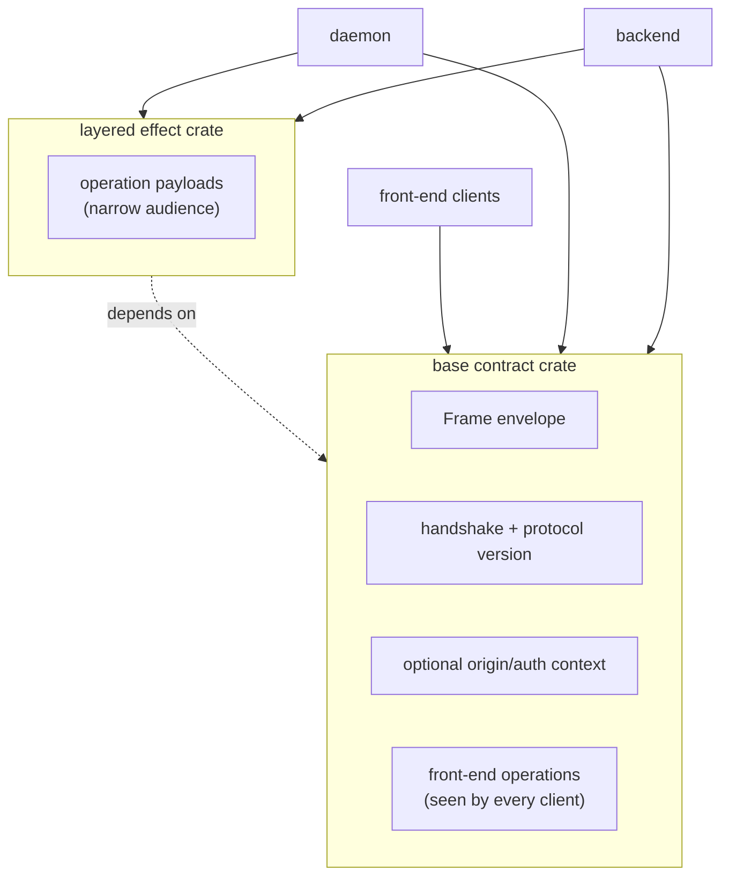
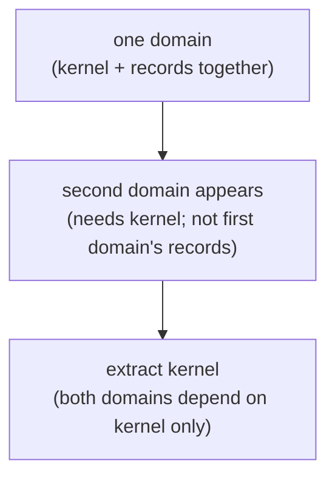
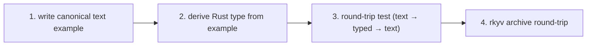
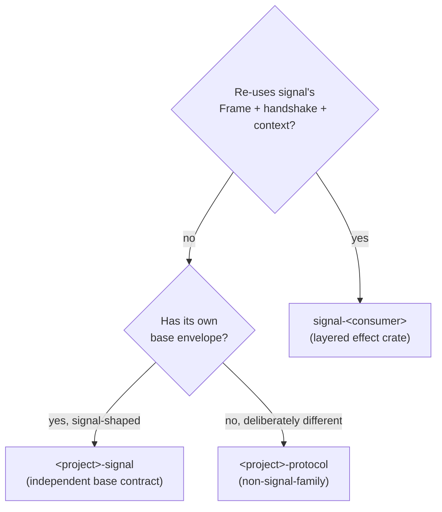

# Skill — contract repos

## When to reach for it

When two or more Rust components **signal** each other over a wire — Unix
socket, TCP, message bus, named pipe, mmap region — the record types they
exchange live in a contract repo: one crate, every consumer pulls it as a
dependency. *Signaling* is the workspace verb for inter-component
communication via length-prefixed rkyv archives. A contract repo is the
typed vocabulary of one signaling fabric: the shared `Frame`, the closed
enum of payloads, the handshake, and any identity/origin/auth context that
genuinely crosses that boundary.

This applies the "perfect specificity at boundaries" essence across
processes, and sits on top of `skills/rust/storage-and-wire.md` (which
defines the Rust wire rules). The canonical example is **signal** — read
its `ARCHITECTURE.md` once before designing a new contract repo.

## Why it exists

rkyv archives interoperate **only** when both ends compile against the same
types with the same feature set:

- **Schema agreement.** A `Frame` defined in one component and redefined in
  another is two types — the bytes don't round-trip even if the field lists
  look identical. The contract crate is the single definition.
- **Derive sharing.** Wire derives (rkyv `Archive`/`Serialize`/`Deserialize`,
  `bytecheck`) and text derives (`NotaEnum`/`NotaRecord`/`NotaTransparent`)
  both live with the type. The contract owns the wire shape AND the text
  shape on the same types; consumers don't carry shadow types. Re-deriving
  per consumer is dead code at best, drift at worst.
- **Layered stability.** When a layered effect crate adds operation payloads
  (e.g. signal-forge over signal), clients depending only on the base
  contract don't recompile on layered-crate churn.

The anti-pattern: types defined in A and copy-pasted into B; two components
own "the same" wire format; bytes silently drift on schema changes. rkyv's
strict layout makes this invisible — no parse error, just wrong values.

## What goes in a contract repo

```
contract-repo/
├── src/
│   ├── lib.rs        — module entry + re-exports
│   ├── frame.rs      — Frame envelope, encode/decode, error type
│   ├── handshake.rs  — ProtocolVersion + handshake exchange
│   ├── origin.rs     — origin/auth context records (only when the boundary carries them)
│   ├── request.rs    — Request enum (closed; per-operation dispatch)
│   ├── reply.rs      — Reply enum (closed; matches request kinds)
│   ├── <operation>.rs — per-operation typed payloads
│   ├── <kind>.rs     — domain record kinds + paired *Query types
│   └── error.rs      — crate Error enum (thiserror)
├── tests/            — round-trip per record kind, per operation
├── Cargo.toml        — pinned rkyv feature set, versioned
└── ARCHITECTURE.md   — what's owned, what's not, schema discipline
```

The contract crate **owns**:

- The `Frame` envelope and its `encode`/`decode` methods.
- The length-prefix framing rule (4-byte big-endian per archive).
- Handshake, protocol version, and the compatibility rule.
- Origin/auth context records, only when the boundary carries identity,
  provenance, capability, or signature material. Don't create a proof type
  just because a template has a slot for one.
- The closed enum of request kinds + paired reply kinds.
- Per-operation typed payloads (closed enums of typed kinds — no generic
  record wrapper, no `Unknown` variant).
- The version-skew guard's known-slot record (schema + wire-format version).
- A round-trip test per record kind — rkyv frame round-trip AND NOTA text
  round-trip, both witnessed in `tests/`.
- `NotaEnum`/`NotaRecord`/`NotaTransparent` derives on the typed records, so
  the same type IS the wire record AND the text record; consumers consume it
  once.
- Reserved record heads. No domain type defines a record kind named `Bind`
  or `Wildcard`; those heads belong to `signal_core::PatternField<T>`
  dispatch, workspace-wide.

It **does not own**:

- Daemon code. No actors, no runtime, no `tokio`.
- Component-internal runtime state — each daemon's redb tables, reducer
  state, supervisor tree, write paths, transaction boundaries, and the
  `Database::open` call stay inside the daemon.
- Logic that interprets the records — validation pipelines, routing rules,
  gate decisions stay in the daemons.
- NOTA projection *policy* and *surfaces*. It owns the text codec on its
  types, but not *where* NOTA renders (which CLI prints it, which endpoint
  accepts it, which audit format wraps it) nor the composition of Nexus
  wrapper records for a particular human-facing form. Projection policy
  lives in the boundary component.
- Configuration. `Cargo.toml`, `flake.nix`, deployment.
- `serde` as the wire. Types may *also* derive serde for debug rendering,
  but the contract is rkyv-on-the-wire.

It **may own**:

- **Typed introspection record shapes for durable inspectable state.** A
  contract crate may declare the typed shape of a redb-stored value so peer
  components and `persona-introspect` can name what's inspectable. It owns
  the *vocabulary* of inspectable state; the component still owns the
  database, reducers, consistency model, and projection policy. Operational
  records stay in their operational contract; introspection-only records may
  land in a dedicated `signal-persona-<X>-introspect` crate when the
  inspection vocabulary is heavy or high-churn enough to separate.

## Contracts name a component's wire surface

A contract repo is the typed-vocabulary bucket for **one component's wire
surface**. Multiple relations within one component are fine — a harness
component speaks delivery-from-router, identity-query-from-anyone,
transcript-tail-to-subscribers, lifecycle-observation-to-mind, all in one
`signal-persona-harness` crate. The component is the unit of contract
ownership; its relations co-evolve and share the typed records they touch.

A contract crate is **not** a workspace-wide grab bag mixing vocabularies
from unrelated components. A crate holding both signal-persona-mind and
signal-persona-router records has become a shared-utilities crate — split it.

Name each relation explicitly in `ARCHITECTURE.md`, and split source modules
by relation when file count justifies it (`src/delivery.rs`,
`src/identity.rs`, `src/transcript.rs`). For each relation, state in plain
English:

1. **Endpoints.** Who sends, who receives, who only observes.
2. **Cardinality.** One-to-one, many-to-one, one-to-many, many-to-many.
3. **Direction.** Which facts are requests, replies, events, observations,
   subscriptions, assertions, mutations, retractions.
4. **Authority.** Which side mints identity, time, slots, revisions, sender
   fields — those must never be agent-supplied.
5. **Lifecycle vectors.** What can happen at the relation's root: submitted,
   accepted, rejected, assigned, unassigned, closed, expired, cancelled,
   observed.

Each named relation has its own closed root enum (or closed
request/reply/event family) naming that relation's vectors. A `Request`,
`Reply`, or `Event` variant is not "whatever payload fits today" — it is one
mutually-exclusive way the relationship can move. A multi-relation crate has
one root family per relation, not one crate-wide enum. Wrong root variants
force every consumer to program with the wrong model.

### Naming is load-bearing architecture

- Prefer domain nouns for payload records: `Submit` carries a `Message`,
  `Configure` carries a `Configuration`, `Register` carries a `Registration`.
- Operation roots are verbs, in verb form: `Submit`, `Query`, `Observe`,
  `Configure`, `Register`, `Retire`, `Start`, `Stop`. Don't force public
  actions under Sema state-effect words like `Assert` or `Match`.
- Don't repeat namespace already supplied by the crate, module, channel,
  relation, owning component, or enclosing enum. A `signal-repository-ledger`
  payload named `RepositoryChangedFileQuery` is wrong — the ledger context is
  already supplied; use `ChangedFileQuery`. `PersonaMessage` repeats the
  crate namespace; `Message` is right when the relation is message-shaped.
- Don't fix under-specified names with generic suffixes. `Data`, `Payload`,
  `Info`, `Operation`, `Generic`, `Mixed`, `Ok`, `ThingRequest` are warning
  signs unless the surrounding relation makes them exact.
- A variant and its payload may share a domain noun when that noun is the
  exact vector — better than shortening the variant until it's vague. If it
  stutters, split: root variant names the vector, payload type names the
  record.
- Field names inherit context from their record. Keep fields short when the
  record supplies the noun, but newtype the wire form when the primitive
  alone is too weak (`WirePath`, `TaskToken`, `TimestampNanos`, `QueryLimit`).
- Never encode lifecycle uncertainty as `Unknown` or a string kind. Add the
  missing vector as a closed enum variant, then coordinate the upgrade.

Run the naming pass in order: (1) read `ARCHITECTURE.md` and write the
relation sentence; (2) classify every top-level enum (root vector set,
payload kind set, lifecycle state, error reason, identity reference); (3)
audit root variants first — they set the grammar all payload names must fit;
(4) audit payload structs and nested enums; (5) audit field names and
primitive wrappers; (6) read examples and call sites last — if code reads
like the wrong relationship, rename before writing more consumers.

For a new repo or large rename, make the naming review an explicit work
item. Contract names are harder to escape than architecture prose: once
consumers compile against them, the names become the enforced model.

## Public contracts use contract-local operation verbs

Three layers, distinct vocabularies:

```text
Contract operations  (external — what crosses the wire)
  public per-contract verbs: Submit, Query, Observe, Configure,
  Register, Retire, State, Watch. Owned by signal-* contract crates.

Component commands  (internal — what the daemon executes)
  per-component typed executable records:
  SpiritCommand::AssertEntry(Entry),
  LedgerCommand::RecordEvent(EventRecord).
  Owned by each daemon; carry the typed payloads engines need.

Sema operations  (cross-component classification — what
                  observation/introspection sees)
  payloadless state-action class labels:
  Assert | Mutate | Retract | Match | Subscribe | Validate.
  Used only for cross-component observation/introspection; never execution.
```

The universal roots (`Assert`, `Mutate`, `Retract`, `Match`, `Subscribe`,
`Validate`) are the **Sema classification vocabulary** — payloadless state-
action class labels, not executable. Executable database work happens via
component-local typed Commands. Contract operations are domain-named; the
daemon lowers them into typed Commands; Commands project to Sema labels for
observation. Sema is the cross-component nervous system at the classification
layer, not a universal executable database DSL.

Each Component Command projects to a Sema class via a `ToSemaOperation`
trait. The engine layer is a reusable framework parameterized over the
component's Command type — atomic boundaries, snapshots, redb transaction
handling are common; the Command vocabulary is component-local.

The client sends what it wants to do at the boundary:

```nota
(Submit (Message ...))
(Query (RecentRepositories ...))
(Configure (DaemonConfiguration ...))
(State (Quote ...))
```

The daemon decides whether that public action lowers to no Sema effects,
one, many, a forwarded request, or a rejection.

### Operation naming rule

The operation root is a verb in verb form: `Submit` not `Submission`;
`Query` not `QueryRequest`; `Observe` not `Observation`; `Configure` not
`Configuration`; `State` not `Statement`. The payload is usually a noun:
`(Register (Registration ...))`.

Same verb spelling across contracts is allowed — receiver context supplies
the meaning. `Observe` in a ledger contract and `Observe` in a Spirit
contract need not mean the same thing beyond "caller asks this receiver to
observe something in its domain."

### Sema classification vocabulary is forbidden on the public wire

| Sema operation | Layer meaning |
|---|---|
| `Assert` | insert/append a typed fact/event/row |
| `Mutate` | transition a record at stable identity |
| `Retract` | tombstone/remove/retract a typed fact |
| `Match` | pattern/range/key read over typed tables |
| `Subscribe` | state-plus-delta stream over typed tables |
| `Validate` | dry-run validation/planning without commit |

These words belong in the Sema engine layer and in any explicit Sema-facing
contract (signal-sema itself, or a deliberately Sema-facing socket that IS
the public service offered) — never on an ordinary component's public wire.
The six words must not appear as request-root tags, a contract must not
mirror them as an `AuthorizedSignalVerb` enum, and a contract event must not
carry a payloadless `SemaObservation` label. Contract roots are domain
verbs; the Sema class is derived by the daemon internally, never sent or
named on the wire by a peer.

### Lowering is daemon logic

```text
public contract operation
  -> validation / routing / authorization
  -> Sema operation plan when durable state changes or reads are needed
  -> commit / reply / event
```

Lowering belongs in the runtime component, not the contract crate. The
contract may define typed records that make lowering inspectable, but it
owns no reducers, authorization, routing, transaction boundaries, or table
execution.

Static lowering: `Query RecentRepositories -> Sema Match over repository
indexes`; `Watch Entries -> Sema Subscribe over entry tables`. Dynamic
lowering: `Submit Message` may reject without write, assert an ingress
event, mutate delivery state, then forward to the router.

### Tests for contract-local verbs

- every operation root is a domain verb in verb form;
- no public operation wraps payloads in mandatory Sema roots unless the
  contract is explicitly Sema-facing;
- examples round-trip in NOTA and rkyv using the same typed records;
- repeated suffixes (`*Query`, `*Command`, `*Event`, `*Listing`) are checked
  as schema smells before the shape is accepted;
- when a daemon publishes lowering witnesses, those witnesses prove the
  runtime mapping from public operation to Sema plan.

Stale shapes to avoid — `(Assert (Message ...))`, `(Match (Query ...))`,
`(Mutate (Configure ...))` — become `(Submit (Message ...))`, `(Query
(...))`, `(Configure (...))`.

### Reply discipline

- **Success variants are verb-past-tense matching the root.** `Submit` →
  `Submitted`; `Register` → `Registered`; `Launch` → `Launched`; `Retire` →
  `Retired`; `Query` → `Queried`/`Observed`.
- **Rejection variants are verb-past-tense + `Rejected`.** `Submit` →
  `SubmitRejected`. Domain rejection reasons are payload variants of the
  `*Rejected` reply (typed enum, e.g. `SubmitRejectionReason`).
- **On collision with a verb-derived noun,** fall through to the next-best
  past-tense naming what the daemon did. `Announce` → `Announcement` (noun
  collision) → `Identified` (the daemon identified the announcer).
- **Lifecycle-shaped verbs (`Start`/`Stop`/`Drain`)** may share a single
  `Action*` pair when the response shape is uniform:
  `ActionAccepted(ActionAcceptance)` / `ActionRejected(ActionRejection)`.
  Both `Start` and `Stop` use the same pair because the reply doesn't vary by
  which lifecycle verb fired.

Replies are causally tied to the operation they answer. If a "reply" becomes
an independent observation that can travel without a request, model it as an
event/stream record — don't hide independent event traffic inside a reply
enum because it was convenient for the first test.

**Event variant naming follows the same verb-past-tense rule.** A
`RecordStream` emits `RecordCaptured`; a `StateStream` emits `StateChanged`.
Past-tense outcome describing what happened, not what was requested.

## The layered pattern

When a wire protocol has audience-scoped concerns — operation families only
a subset of components care about — those land in a **layered effect crate**,
not the base contract:



The layered crate (signal-forge over signal is canonical) **re-uses** the
base `Frame`, handshake, and boundary origin/auth context, and **adds** its
own operation payload enum. New layered operations land there; front-end
clients depending only on the base contract don't recompile.

Use a layered crate when: the operations have a narrow audience (sender +
receiver + maybe one transitional caller, not "every client"); the base
contract would otherwise absorb effect-specific concerns that don't belong
on the front-end surface; recompile cost across many front-end clients is
real. Don't pre-layer — the shape becomes obvious after one effect-bearing
leg is real and a second is being added.

## Versioning is the wire

The contract crate's semver IS the wire's semver:

- **Major** = breaking layout or semantics. Every consumer upgrades together
  (coordinated upgrade).
- **Minor** = backward-compatible addition (new variant in a forward-tolerant
  enum, new optional field). Forward-compatible enums must be marked open in
  their decoding strategy; closed enums never accept minor additions.
- **Patch** = docs, tests, internal cleanup. No layout or semantic change.

Pin the contract version in every consumer's `Cargo.toml`. Don't
`git = "..."` against `main` for production wire — `main` moves under your
feet. Use a tag or a version-pinned crates.io release.

The **version-skew guard** is part of the wire: a known-slot record at the
canonical key carrying `(schema_version, wire_version)`, checked at boot.
Hard-fail on mismatch. The guard runs *before* the daemon handles traffic; a
mismatch is a coordinated-upgrade signal, not a runtime error to recover
from.

## How NOTA fits

NOTA is the project's only text syntax. Nexus is a NOTA-using
request/message surface, not a second syntax. The contract crate owns both
the wire form (rkyv) and the text form (NOTA) of its typed records — the
same type IS both. Consumers carry no shadow types; round-trip witnesses for
both forms live in `tests/`.

NOTA is **not the inter-component wire**. Component-to-component traffic uses
rkyv frames. NOTA *renders* only at surfaces touching a human or a log:

| Boundary | Format |
|---|---|
| Component ↔ component (Rust ↔ Rust) | contract-crate types via rkyv frames |
| CLI text edge | NOTA on argv/stdin, often through a convenience CLI that builds the Nexus wrapper before encoding the daemon's binary frame |
| Daemon startup / daemon ↔ daemon | pre-generated signal/rkyv startup messages and contract types via rkyv frames; daemon never parses NOTA text |
| Harness terminal adapter edge | adapter projects a typed record to user-facing text before write |
| Audit logs / debug dumps | NOTA projection of typed records |

The CLI, router, and text/terminal adapters render NOTA using the contract
crate's derives; they don't re-derive their own text projection. Everywhere
else, components hold typed records in memory or rkyv archives on disk and
the wire.

If a contract's architecture says it owns the *human-facing surface* — argv
parsing, audit-log formatting, terminal-prompt composition — narrow it. The
contract owns the *codec* on its types (wire AND text); the boundary
component owns the *surface*. Codec round-trip witnesses (rkyv and NOTA) go
in the contract crate; surface witnesses go in the boundary component.

## When to introduce a contract repo

It's now, not "later", when: a second component is about to read or write
the same wire bytes (two components ⇒ contract crate); the first component
had its types in a private module and the second now needs them (hoist); a
schema change must land in two crates simultaneously (the pain is the
signal).

It's **not yet** when: one daemon, no clients, no other reader (keep types
private until a second consumer appears); or prototyping a serialization
shape that'll change three times this week (stabilise, then hoist).

Premature hoisting costs a one-consumer contract repo — low overhead. Late
hoisting costs a silent schema-drift bug that survives review because both
copies *look* the same. Err early.

## Kernel extraction trigger

A contract repo grows two ways: **domain growth** (new record kinds, typed
payloads, query shapes within the original audience) and **audience growth**
(a *second* domain wants the same wire conventions). Audience growth triggers
extraction: when two or more domains share the kernel, extract the kernel
into its own crate so neither domain's records contaminate the other's
namespace.



Concrete: `signal` originally held both the sema-ecosystem's kernel (Frame,
handshake, early shared operation vocabulary) and Criome's record kinds
(Node, Edge, Graph). When `signal-persona` needed the same kernel, leaving
everything in `signal` would have forced it to depend on a Criome-flavored
crate — the boundary confusion this skill prevents.

The extraction: a new crate (`signal-core`) holds Frame, handshake, version,
exchange/stream mechanics, and only the origin/auth context truly shared by
every domain. The original crate (`signal`) becomes the first domain's
*vocabulary* over the kernel (Criome's records and payloads). The new domain
(`signal-persona`) is another *vocabulary* over the kernel. After extraction
both depend only on the kernel, not each other; new domains join without
naming confusion.

**Don't extract early.** With a single domain, kernel-and-records-together is
fine. A one-domain contract crate costs zero; a kernel crate with no second
consumer is one extra artifact to maintain. Wait for the second domain.

The layered-crate pattern is complementary: a layered crate adds operation
payloads for a narrow audience but depends on the same kernel as the base
contract. After extraction, signal-forge depends on the kernel directly plus
the base contract for record kinds it references.

## Examples-first round-trip discipline

Every record kind lands as a concrete text example + a round-trip test
before its Rust definition is final.



1. **Write the canonical text example** before defining the struct — what
   the record looks like in Nexus text. It exercises field positions, typed
   enum variants, optional fields. If the example is awkward, the type is
   wrong; fix the type before coding. The example is the falsifiable
   specification — a Rust definition without one is unverified guesswork.
2. **Derive the Rust type from the example.** Struct field order matches the
   example's positional order; the closed enum's variant set matches what
   the positions can hold; PatternField fields match where binds and
   wildcards appear.
3. **Round-trip test first** — `text → typed → text`, asserting equality. If
   it doesn't close, the codec or type has a bug. Catches encoder/decoder
   asymmetry immediately.
4. **rkyv archive round-trip second** — encode to bytes, decode, equal the
   original. Per-feature-set parity (see `repos/lore/rust/rkyv.md`) is
   checked independently.

A new agent reads the example before any Rust source and knows what the
record kind is *for*. Each kind ships with: an entry in the canonical
examples file (one canonical text form per kind), a test in `tests/<kind>.rs`
exercising both directions, and the definition in `src/<kind>.rs`. If the
example file is empty, the contract crate is incomplete even when all Rust
compiles.

## Naming a contract repo

The crate is the *protocol the components speak*. The name reflects its
relationship to `signal`.

### `signal-<consumer>` — layered effect crate (prefix form)

When the contract is layered atop `signal` — re-uses signal's `Frame`,
handshake, and shared boundary context, adds operation payloads for a
narrower audience: `signal-forge` (criome ↔ forge), `signal-arca` (writers ↔
arca-daemon), `signal-persona` (Persona's wire). Read as "this is signal,
scoped to consumer." Front-end clients depending only on `signal` don't
recompile when a layered crate churns. **This is the default — the layered
shape is how the signaling fabric grows.**

### `<project>-signal` — independent base contract (suffix form)

When the wire is its own base contract — owns its own `Frame`, handshake, and
boundary context: `signal` itself (no prefix because it IS the base). Use
only when the project is genuinely a separate signaling fabric with its own
envelope and boundary-context shape. Almost always, what feels like "a new
ecosystem" is better modelled as a layered crate atop signal.

### `<project>-protocol` / `<project>-contract` / `<project>-wire`

Escape-hatch names for projects that deliberately use a different wire shape
than the signal-family — different framing, different envelope, no
convergence intended.

### Choosing



Don't name the consumer's *internals* (`<project>-types`,
`<project>-shared`) — the repo isn't a bag of utilities, it is the spoken
protocol.

## Common mistakes

| Mistake | What it looks like | Fix |
|---|---|---|
| Types redefined per consumer | Each daemon has its own `Frame` struct with the same fields | One contract crate; every consumer depends on it |
| `serde_json` between Rust components | "We'll switch to rkyv later" | rkyv from the start; prototype with rkyv too |
| `path = "../contract"` in `Cargo.toml` | Local sibling reference | `git = "..."` with a tag, or a published version. Cross-crate `path = "../sibling"` is forbidden (micro-components) |
| Contract crate carries logic | Validation, routing, or reducer code in the contract | Move logic to the daemon; contract holds types only |
| Contract crate has a runtime dependency | tokio, kameo, nix system bindings | Depend only on rkyv + thiserror + (optionally) the project's derive crate |
| New wire operation in the base contract because it was easy | Front-end clients recompile on every effect-side change | Add a layered effect crate; base stays stable |
| No `ARCHITECTURE.md` | Schema discipline unwritten | Every contract repo carries `ARCHITECTURE.md`; schema discipline is the load-bearing part |
| Open enum where closed was meant | Adding `Unknown` "for forward compatibility" | Closed enum + coordinated upgrade. `Unknown` is a polling-shaped escape hatch |
| Boundary unnamed | Described only as "shared types"/"messages", no named endpoints, direction, authority, lifecycle vectors, or owning component | Name what crosses: which endpoint, direction, authority minting, lifecycle vectors. Sharing types is fine; failing to name what they speak is the bug |
| Root variants underspecified | `Ok`, `Generic`, `Mixed`, `Data`, or `Submit` where several things can be submitted | Name the vector exactly, or move the generic word under a more precise enclosing enum |
| Namespace repeated as a prefix | `PersonaMessage`, `SignalPersonaRequest`, `RepositoryChangedFileQuery` inside `signal-repository-ledger` | Let crate/module/channel/enum context carry the namespace; keep the type name on the domain thing |

## See also

- `skills/rust/storage-and-wire.md` — the Rust rules for the binary
  contract; this skill organises those types into repos.
- `skills/micro-components.md` — every component is its own repo; the
  contract crate is the typed protocol between them.
- `skills/push-not-pull.md` §"Subscription contract" — contract crates own
  the subscription frame types.
