# Skill — Mermaid syntax (workarounds and traps)

Mermaid renderer quirks that trip diagram authors, and the
readability rules that make a diagram worth including.

Target the strictest renderer you publish to. Mermaid 8.8.0 (what
Substack ships) is stricter than current Mermaid Live on subgraph
titles, edge Unicode, sequence/state-diagram punctuation, and
keyword collisions — so a Mermaid Live render is not proof a block
will survive 8.8.0. Readability is part of correctness: a clipped
or text-dense graph is a failed graph.

## Node labels are quoted strings; edge labels are pipes

Mermaid's grammar treats node labels and edge labels differently.
Quoted strings are node-shape syntax; edge labels go in pipes.
Mixing them — a quoted string where an edge label belongs — looks
plausible and fails to parse.

Quote a node label whenever it contains hyphens, slashes,
punctuation, parentheses, or multiple words. Do this even when the
renderer accepts the unquoted form; unquoted punctuation behaves
inconsistently across renderers.

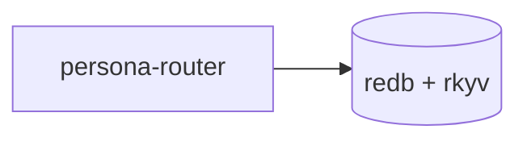

## Graph size — 4-8 nodes, factor bigger graphs

The eye holds a topology of ~5-8 nodes before the diagram becomes
a wall of boxes; past that, edges crisscross, layout heuristics
give up, and the reader scrolls sideways. Aim for 4-8 nodes per
diagram, hard cap around 10.

When the substance needs more, the diagram has become a system
map. Split it into focused diagrams that each answer ONE question
— data flow, type lineage, control flow, failure modes — and let
the surrounding prose compose the mental model across them.

Subgraphs do not buy you headroom: three subgraphs of 5 nodes is
still 15 nodes on the canvas. If the substance partitions cleanly,
the partitions read better as sibling top-level diagrams than as
subgraphs inside one master diagram.

The test: can a reader take in the topology in one glance, without
scrolling? If not, factor. Counter-pressure: don't fragment to
confusion — a 3-node diagram is fine when 3 nodes IS the topology.
Match diagram size to substance, not to a token target.

## Label sizing — short prose, IDs out of the node

Renderers clip node text at the box width; long labels truncate
mid-word and the reader sees neither head nor tail. The cure is
upstream: write labels short enough to fit.

Aim for 2-5 words per node label — a noun phrase naming the
concept. Budget: one-line node label 24-28 visible characters;
edge label 1-3 words. If a label needs more, the node is doing
prose's job — shorten it and move the detail to the surrounding
paragraph, caption, or sibling table.

### Labels stay single-line

Do not insert manual line breaks. Escaped newlines (`\n`) are not
respected consistently and often render as literal noise; HTML
breaks (` `) and markdown wrapping behave differently across
versions and surfaces. A graph that depends on label line breaks
is not portable.

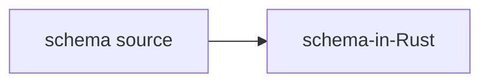

The detail moves into the prose around the graph: `schema source`
means the full-NOTA `schema/lib.schema` document; `schema-in-Rust`
means the typed, rkyv-serializable image the codec deserializes it
into. If one compact label cannot carry the concept, split it into
separate nodes or drop the detail — do not simulate a paragraph
inside a box.

Mermaid offers no dependable fixed box-width knob across
renderers. Partial controls: `flowchart.wrappingWidth` (max text
width before markdown labels wrap, newer renderers),
`flowchart.padding` (label-to-shape padding, newer experimental
path), and `classDef roomy padding:18px;` as the least-bad
workaround. Use padding only to give SHORT labels breathing room —
it does not make long labels acceptable.

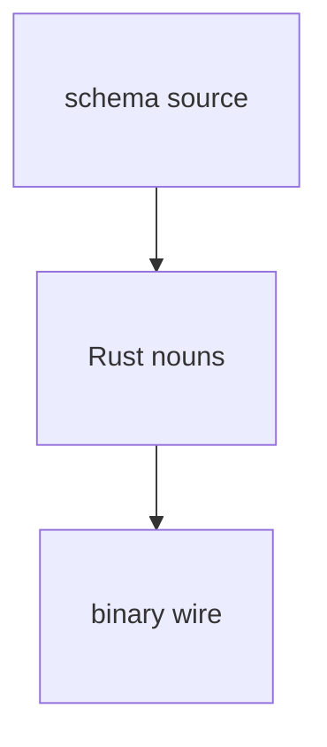

### Keep IDs and locators out of nodes

Bead IDs (`primary-li0p`), full file paths
(`signal-frame/src/namespace.rs:55-86`), long identifier names
(`emit_contract_section`), section locators (`§1.6.7`), and
multi-part conjunctions (`Foo + Bar + Baz`) all eat box width,
truncate badly, and are decodable only by someone with a CLI open.
A short prose label (`section attribute`, `triad witness`) carries
the same meaning.

When the substance genuinely includes IDs, paths, or citations,
use the diagram-and-table pair: the diagram carries short prose
labels (reader sees *what relates to what*); a sibling table
immediately below maps each label to its ID/path and a one-line
description (reader sees *what each thing IS*).

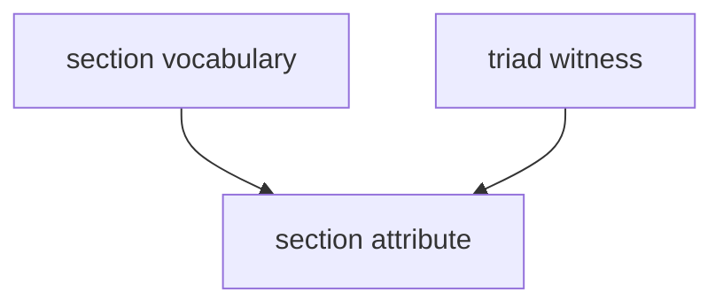

| Node label | Bead | Adds |
|---|---|---|
| section vocabulary | `primary-li0p` | `NamespaceSection` + `classify` |
| triad witness | `primary-avog` | `assert_triad_sections!` macro |
| section attribute | `primary-v5n2` | `contract_section:` grammar |

The short-label rule applies UNIFORMLY across every label
position, not just flowchart nodes: subgraph titles (3-5 words, no
parentheticals, no IDs), edge labels (1-3 words: `depends on`,
`feeds`, `broadcasts to`), sequence message text, state-diagram
transition labels, and `Note` text. For any of these, if the
substance needs more than ~5 words, the diagram is carrying prose
— factor the explanation out into the report text.

Before finishing, inspect each graph in the target surface or a
screenshot. If any label clips, truncates, forces sideways
scrolling, or is illegible at the report column width, rewrite it
before the report is done.

## Edge labels are prose, not notation

Pipe-delimited edge labels are lexer-sensitive. A label starting
with a sigil or punctuation can be tokenised as a link-style
identifier and fail with a `LINK_ID` parse error. Use plain-prose
relationships (`derives`, `lowers`, `feeds`, `projects`); put
literal notation tokens in the node label, surrounding prose, or a
sibling table.

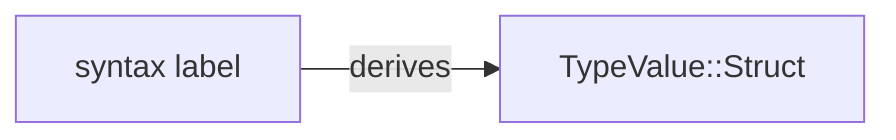

Anti-pattern: `entry -->|@derive| lowered` — the `@`-prefixed
token trips the lexer.

## Node IDs — ASCII identifiers, never bare quoted strings

Bare quoted strings as node IDs are broken in older renderers
including 8.8.0: the parser treats `"mind CLI" --> "MindRoot"` as
invalid flowchart syntax even though the strings look like labels.
Always give the node a simple ASCII identifier (lowercase letters,
digits, underscores) and put the visible label in brackets.

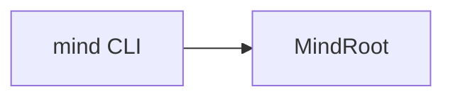

## Edge labels — pipe delimiters, NOT quoted strings

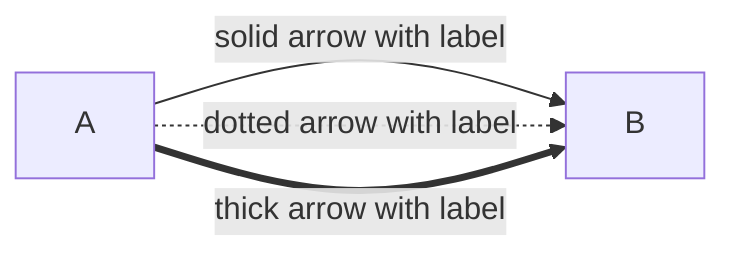

`A --> "label" --> B` looks like it should work but the parser
rejects it. Quoted strings are node shapes; edge labels go in
pipes. The anti-pattern `layers -.- "drift register" -.- gaps`
fails with `Expecting ... 'PIPE' ... got 'STR'` — the `'PIPE'` in
the expected-token list is the parser telling you it wanted
`|label|`. This holds for every edge variant (`-->`, `-.->`,
`==>`, `---`, `-.-`, `===`).

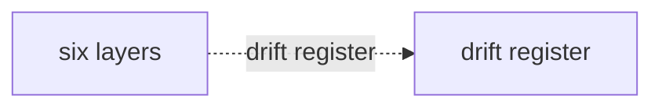

## Avoid reserved-word node IDs

Mermaid reserves identifiers across diagram types — `graph`,
`flowchart`, `subgraph`, `end`, `class`, `classDef`, `style`,
`link`, `linkStyle`, `note`, `click`, `direction`. Using any as a
node ID breaks the parser (8.8.0 is strict; the failure renders as
a "Syntax error in graph" image). 8.8.0 can also collide on
underscore-separated ID segments, so avoid `mind_graph`,
`state_link`, `audit_note`. The label inside the brackets is fine;
only the ID must dodge the keyword.

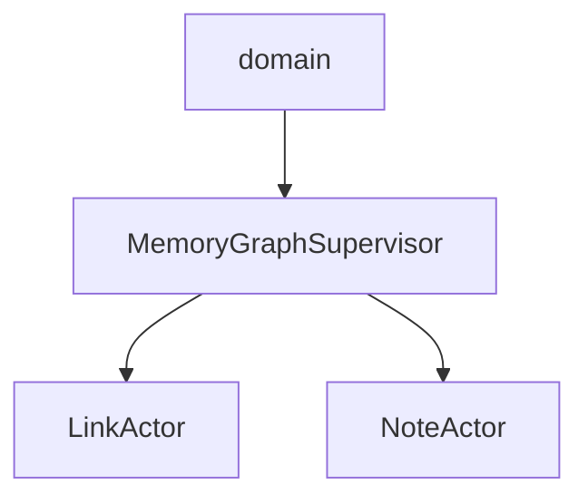

Actor-topology diagrams collide most often; default to suffixing
every node ID by what it is — `_actor`, `_supervisor`, `_table`,
`_view`. The labels render unchanged; the suffix dodges the parser
silently and cheaply.

## Mermaid 8.8-safe diagram syntax

8.8.0 is stricter than current Mermaid Live in places agents hit
when writing prose-heavy diagrams. Keep syntax ASCII-simple and
put prose in labels, not in identifiers or parser-sensitive
punctuation.

### Subgraphs

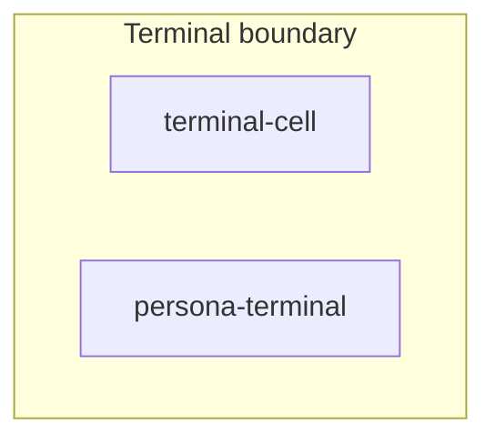

- Put a space between the subgraph identifier and the title
  bracket: `subgraph terminal_group [Terminal boundary]`. The
  no-space quoted-bracket form `terminal_group["..."]` is rejected
  by 8.8.0.
- No quotes inside the title bracket: `[Terminal boundary]`, not
  `["Terminal boundary"]`.
- No `direction TB`/`direction LR` inside a subgraph; 8.8.0 has no
  subgraph-local direction — the subgraph inherits the parent's.
- Keep titles punctuation-light: no parentheses, slashes,
  semicolons, or arrows. Use commas, `and`, or a shorter title.

### Flowchart edge labels

Avoid Unicode arrows (`↔`, `→`) inside `|label|`. Write `to`,
`from`, `and`, or split the edge.

### Sequence diagrams

8.8.0 treats `;` as a statement boundary, so a semicolon in
message text, participant aliases, or `Note over`/`Note left of`/
`Note right of` text fails the parse even when the sentence reads
fine. Use "and", a comma, or split into separate messages/notes.

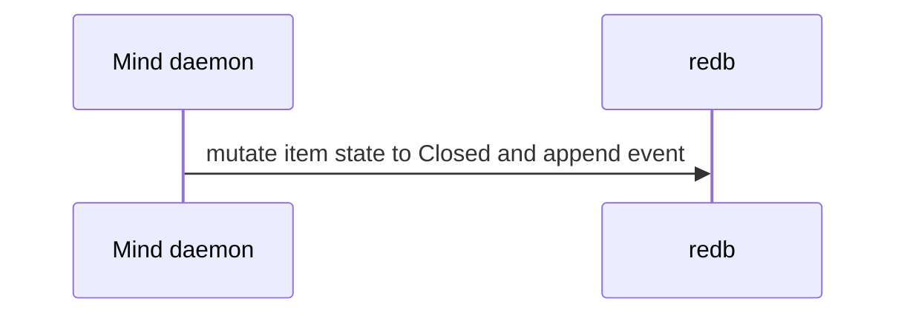

Arrow operators with letters — `-x`, `--x`, `-)`, `--)` — need
whitespace separating the actors from the arrow. `Cli-xOld:
connection refused` lexes `Cli-xOld` as one identifier and
explodes with a confusing error pointing elsewhere.

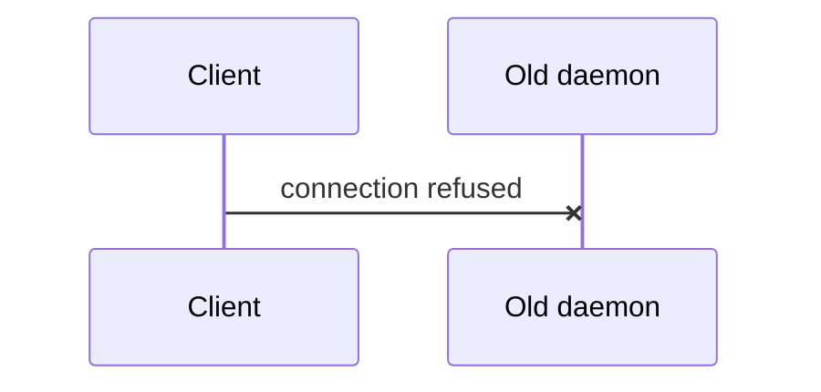

Plain `->>` and `-->>` don't require the spacing, but default to
spaces around all arrows for readability.

### State diagrams

`stateDiagram-v2` carries the same semicolon-as-statement-boundary
behaviour: transition labels MUST NOT contain semicolons. Use
"and" or split into separate transitions. State names follow the
short-prose rule — PascalCase nouns of 1-3 words; longer
descriptions overlap neighbouring states and belong in prose.

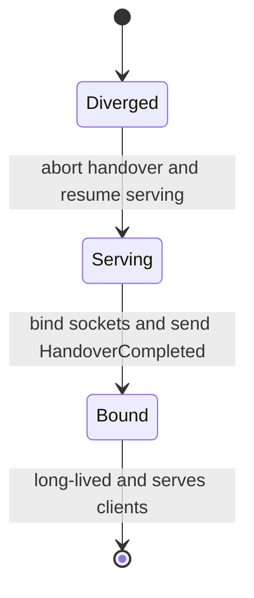

## Parse before publishing

Parse the raw Mermaid block with the target renderer version
whenever you know it. A Mermaid Live render does not prove an
8.8.0 surface will accept the block. The parse error is the only
signal the markdown itself gives you: GitHub-flavoured markdown
silently shows a failed block as its literal source, which is easy
to miss in review.

## See also

- `skills/reporting.md` — when to write reports and the broader
  "prose + visuals" rule that brings you here.
- `skills/skill-editor.md` — skill-writing conventions.
