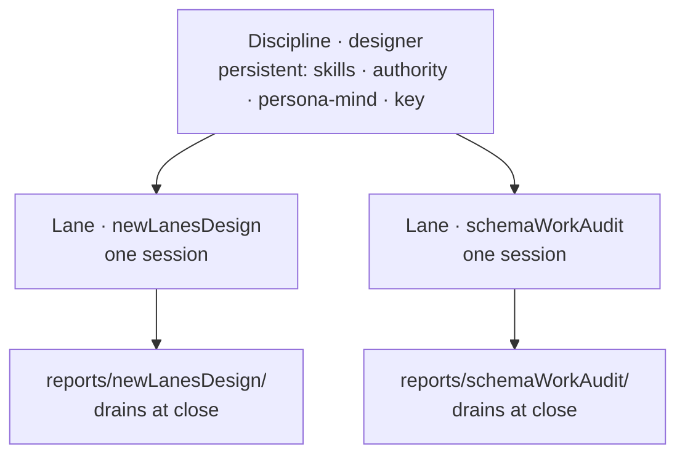

# Skill — session lanes

## Discipline persists; the lane is the session

Two ideas that used to be one name are now split.

A **discipline** is a permanent identity. The nine — designer, operator,
system-operator, system-maintainer, poet, editor, videographer,
assistant, counselor — each carry a skill set, an authority class, a
persistent persona-mind memory, and a signing key. A discipline is the
metadata that says *what kind of agent this is*: which skills load, what
it is allowed to touch, whose memory and key it speaks with. Disciplines
do not come and go.

A **lane** is a single work session, named for that session's intent —
`newLanesDesign`, `schemaWorkAudit`. A lane is throwaway: it opens to do
one body of work, runs, drains, and is retired. The lane name is the
session's intent, not a role. Every lane carries its discipline as
metadata; the discipline loads the skills, authority, memory, and key,
while the lane name marks *what this particular session is for*.

The old fixed role-lanes (`designer`, `second-designer`,
`cluster-operator`, ordinal and qualifier shapes) are retired *as the
lane model*. The disciplines those names denoted survive — as discipline
metadata, no longer as the lane identity.



## How an agent knows its lane

The lane is the session-intent name the harness or psyche gives the
session — the same name as the report directory and the registry lane.
Do not infer it from a discipline or borrow a neighbouring lane's name.
If the session was opened as `schemaWorkAudit` in the designer
discipline, the lane is `schemaWorkAudit`, reports go under
`reports/schemaWorkAudit/`, and the discipline that loads is `designer`.

In the orchestrate registry the lane's role is a NOTA vector of
identifier tokens whose **last token is the base discipline** and whose
preceding tokens are the session-intent specialization — e.g.
`[NewLanesDesign Designer]`. The daemon renders that vector to the
filesystem lane identifier as the hyphen-joined lowercase form
(`new-lanes-design-designer`).

## Registering a lane with the orchestrate daemon

Lane registration is a **meta-policy** operation on the owner-only root,
so it goes through the `meta-orchestrate` CLI (the owner socket), not the
working `orchestrate` CLI. The meta request root carries a `Register`
arm wrapping a `LaneRegistrationRequest`, which is a `Role` vector
followed by a `LaneAuthority`:

- `Role` is a vector of identifier tokens; render it as a square-bracket
  NOTA block, last token the discipline: `[NewLanesDesign Designer]`.
- `LaneAuthority` is one of `Structural` or `Support`.

Worked command (registering this very lane):

```sh
meta-orchestrate "(Register ([NewLanesDesign Designer] Structural))"
```

Reply — the daemon assigns the lane identifier from the role vector:

```
(LaneRegistered (new-lanes-design-designer [NewLanesDesign Designer] Structural))
```

Observe the live lane registry through the working CLI:

```sh
orchestrate "(Observe Lanes)"
;; (LanesObserved [(new-lanes-design-designer [NewLanesDesign Designer] Structural)])
```

`LanesObserved` is the authoritative index of *active* lanes.

## Reports map to the lane

Every lane owns one report directory, `reports/<lane>/`, named for the
session intent — not `reports/<discipline>/`. Numbering is per-lane and
starts fresh each session. The directory is the unit of garbage
collection: it is created when the session opens and deleted when the
session drains.

A report is a **fresh-context pickup point**. Write each one so an agent
starting from a clean context can read it, reason about the work, and —
where the work is implementable — implement it. Implementable work is
linked into a bead dependency graph
(`bd dep <blocker> --blocks <blocked>`), so a later fresh agent can walk
the graph. A continuation or review report states plainly what it
supersedes and deletes its predecessor in the same commit, keeping the
working set small.

## Session lifecycle — smart zone, fleet, drain

Favour a fresh session over endless compaction. A session has three
phases:

1. **Smart zone.** The session's early high-fidelity window — the
   psyche's mark is the first ~100,000 tokens — is for the main agent's
   deepest thinking and intent alignment. Spend it on understanding the
   goal and settling the design, not on mechanical work.
2. **Fleet.** Dispatch fresh-context helpers to explore as soon as a task
   needs more than a few already-known files or any multi-level chase —
   don't wait for the window to be spent. The lead reasons over the
   helpers' distilled responses rather than reading broadly itself; the
   smart zone is for thinking and intent alignment, not for exploration
   the helper owns.
3. **Drain.** At session close every idea routes to exactly one of three
   fates:
   - **intent** — captured durably through the Spirit CLI;
   - **work** — a bead linked into the dependency graph
     (`bd dep <blocker> --blocks <blocked>`);
   - **abandon** — already landed, stale, or wrong; git preserves it.

## Lane retirement

When a lane has drained (every idea routed to intent / work / abandon):

1. **Delete the report directory.** Git history and the session
   transcript are the archive; the working tree shows only active,
   undrained lanes.
2. **Append one entry to `protocols/retired-lanes.md`** — the
   append-only retired-lane registry. The entry carries the lane name,
   the discipline, the git revision range holding its reports, a
   transcript pointer, the drain date, and a one-line statement of what
   the lane decided. This thin index keeps drained sessions discoverable
   for regression and model-behaviour forensics without re-growing the
   working report tree.
3. **Retire the lane in the daemon** through the meta CLI, mirroring
   registration:

   ```sh
   meta-orchestrate "(Retire (Lane new-lanes-design-designer))"
   ```

The daemon's `LanesObserved` indexes active lanes; `retired-lanes.md`
indexes retired ones. Together they cover every session without keeping
the report tree large.
