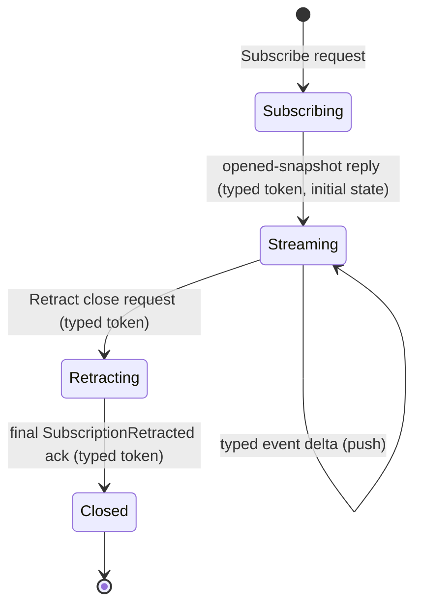

# Skill — subscription lifecycle

Use this skill when designing or implementing a typed push-subscription
on a Signal channel — a long-lived flow where a consumer registers once
and the producer pushes typed events until the consumer closes. It is
the reference for any contract crate declaring a `stream` block and for
any consumer or producer in one.

This is NOT about transport reachability probes, backpressure-aware
pacing, or `timerfd` deadlines — those look polling-shaped but are not
subscriptions (see `skills/push-not-pull.md`).

## The lifecycle FSM

Every typed subscription passes through five named states.



- **Subscribing** — consumer has sent the typed `Subscribe` request;
  no events yet.
- **Streaming** — producer replied with the typed opened-snapshot record
  (per-stream token + initial state). Typed delta events arrive as
  producer state changes.
- **Retracting** — consumer sent the typed `Retract` close request naming
  the token. No more deltas after this, though one or more in-flight
  deltas may already have left the producer's buffer.
- **Closed** — producer emitted the typed `SubscriptionRetracted` ack
  carrying the same token. The connection may be reused or dropped.

Transitions are typed records, never bare socket events. A TCP/Unix
socket reset is NOT a `Retract`; it is transport failure, which the
consumer may observe but is not part of the protocol.

## The kernel grammar enforces it

`signal-core`'s `signal_channel!` macro enforces this shape at compile
time. Every declared stream block must:

- name an `opens` reply variant (the typed snapshot reply);
- name an `event` variant carrying the typed delta;
- name a `close` variant in the request block, **tagged `Retract`**;
- have a `token` type matching the close variant's payload — the
  per-stream identity flows through the close request unchanged.

The kernel is saying: the consumer-initiated close is a typed request,
and the per-stream token is the identity binding open, deltas, and close
together. A contract modeling close as a reply-side-only event fails the
macro's cross-reference check.

```text
signal_channel! {
    channel Harness {
        request HarnessRequest {
            Subscribe SubscribeHarnessTranscript(SubscribeHarnessTranscript)
                opens HarnessTranscriptStream,
            Retract HarnessTranscriptRetraction(HarnessTranscriptToken),
        }
        reply HarnessEvent {
            HarnessTranscriptSnapshot(HarnessTranscriptSnapshot),
            HarnessSubscriptionRetracted(HarnessSubscriptionRetracted),
        }
        event HarnessStreamEvent {
            TranscriptObservation(TranscriptObservation) belongs HarnessTranscriptStream,
        }
        stream HarnessTranscriptStream {
            token HarnessTranscriptToken;
            opened HarnessTranscriptSnapshot;
            event TranscriptObservation;
            close HarnessTranscriptRetraction;
        }
    }
}
```

Five records and one token type carry the whole lifecycle. Nothing is
encoded in the socket state.

## Constraints every subscription satisfies

The producer is the actor owning the observed state. It commits to all:

1. **Open reply is a typed snapshot.** On accepting `Subscribe`, the
   immediate reply carries the token plus a typed snapshot of current
   state. No "subscribe then ask separately for current state" — that
   recreates the race the snapshot removes.
2. **Deltas push as typed events.** Every state change emits a typed
   event carrying enough context to interpret alone; no per-delta
   round-trip.
3. **A sequence pointer orders the events.** Part of the event payload,
   not implicit in socket order, so the consumer can detect gaps and
   re-anchor after reconnection.
4. **Close is a typed `Retract` request** carrying the token. Enforced
   by the kernel grammar.
5. **Final ack is a typed `SubscriptionRetracted` reply** carrying the
   same token; the stream ends after it, so the consumer knows the close
   was honored.
6. **Back-pressure is demand-driven.** The consumer signals capacity;
   the producer never overruns. On a full consumer buffer the producer
   waits, retries, or fails fast — never silently drops events.
7. **Slow consumers cannot block siblings.** Each subscription has its
   own per-subscription state on the producer side; a slow consumer
   holds back only its own stream.
8. **Subscription state survives restart if the producer's state does.**
   Durable subscriptions persist their registration and resume from the
   recorded sequence pointer on restart; transient ones explicitly
   re-open after producer restart.

Each constraint corresponds to a witness test the producer's
ARCHITECTURE.md names (`skills/architectural-truth-tests.md`): the test
proves the path was used, not only that the reply looked acceptable.

## The producer's three-actor shape

A long-lived push subscription is stateful behavior across time, which
means actors (`skills/actor-systems.md`). A producer typically owns
three named planes:

| Actor | Owns |
|---|---|
| `SubscriptionManager` | The set of open subscriptions: token → handler reference, registration metadata, ingress count, close discipline. Routes `Subscribe` and `Retract` to handlers. |
| `StreamingReplyHandler` | One per open subscription. Holds the connection, the token, the consumer's sequence cursor, the outbound buffer, the close-ack flag. Receives `DeliverDelta` from the publisher; writes the event onto the wire. |
| `DeltaPublisher` | The fanout plane. Subscribes in-process to the root state actor's commit events; for each typed change, sends `DeliverDelta { event }` to every relevant `StreamingReplyHandler`. |

The publisher fans out by in-process actor mailbox sends, not by shared
lock or shared channel. Each handler has its own mailbox; one slow
handler stalls only its own mailbox.

Scale down explicitly when the design is small, with the ARCH naming the
scaled-down form and the constraint test naming what the destination
shape will check:

- **One subscription at a time:** collapse `SubscriptionManager` and
  `DeltaPublisher` into the root state actor; keep
  `StreamingReplyHandler` separate so slow consumers cannot block state
  changes.
- **No durable subscription state:** skip the registration-record write;
  track only in-memory.

## When the open snapshot is empty

The open snapshot reply is never optional but may be empty. A
subscription against a fresh producer gets "current sequence = 0,
current state = empty"; against a long-running producer it names the
current sequence and state. The consumer always knows where it starts —
there is no "I subscribed but don't know if I missed events" state.

## Reconnection and resume

When a subscription drops mid-stream (transport failure, producer or
consumer restart), the consumer reconnects by opening a new
subscription. The `Subscribe` request can carry a typed `resume_after`
field (optional sequence pointer); the producer either:

- replays events from `resume_after + 1` if it holds them durably, then
  continues with live deltas; or
- replies `ResumeUnavailable` (a typed reply variant), and the consumer
  accepts the gap and restarts from snapshot.

Both choices are explicit, typed, and observable. The consumer is never
left guessing whether it has a complete view. For prototypes that do not
yet persist subscription state, the typed resume request still exists in
the contract; the producer always replies `ResumeUnavailable`.

## Anti-patterns

**Reply-side-only retraction.** Omitting a `Retract <name>` request
variant and representing close only as a reply event denies the consumer
the right to close — it either leaves the socket hanging (transport
failure as protocol) or has no honest way to say "I am done." The kernel
grammar rejects this shape.

**Socket close as semantic close.** Treating "the socket went away" as a
`Retract` confuses transport failure with consumer intent. A network
partition is not consent. The typed close request is the consent; the
socket is the transport.

**Polling masquerading as subscription.** A "subscription" the consumer
drives by re-asking on a timer is polling with a nicer name. If the
consumer wakes on a clock to ask anything about the producer's state,
the push side is incomplete.

**Shared lock for fanout.** A producer holding an
`Arc<Mutex<Vec<Consumer>>>` and locking it to enqueue every delta
recreates the hidden-lock failure mode `skills/actor-systems.md` warns
against. Use per-consumer actor mailboxes; the mailbox IS the
per-consumer queue.

**No sequence pointer.** A stream without a per-event ordering field
cannot be re-anchored after a hiccup. Add a typed sequence (a newtype,
not bare `u64`) to every event payload.

**Unbounded outbound buffer.** A `StreamingReplyHandler` whose buffer
grows without limit turns a slow consumer into a producer-side OOM.
Bound the buffer; on overrun the contract defines the failure (drop the
slow subscription with a typed failure reply, or refuse more events from
the publisher until the handler drains).

## Witness shape

Every producer's ARCHITECTURE.md names these tests, using real actor
mailboxes and real connections (Unix sockets, in-process channels).
Mocked subscription delivery is forbidden — a mock cannot witness that
the producer holds a real per-subscription handler.

| Constraint | Witness |
|---|---|
| Open returns typed snapshot with current sequence and state. | Subscriber connects to a fresh producer; the open reply is a typed snapshot record with the expected token. |
| One delta per state change, ordered by sequence. | Producer changes state N times; subscriber receives N events with sequence 1..N. |
| Close is typed Retract; final ack is typed. | Subscriber sends typed close; final reply is the typed `SubscriptionRetracted` record with the same token; the stream ends after that frame. |
| Slow consumer does not block siblings. | Two subscribers; one stalls reads; producer keeps emitting deltas to the other within bounded latency. |
| Back-pressure is demand-driven. | When a subscriber's buffer is full, the producer waits or fails fast per the typed contract; never overruns. |
| Sequence pointer is monotonic. | Read N consecutive events; the sequence field is strictly increasing. |

## See also

- `skills/push-not-pull.md` — recognising polling and the named
  carve-outs that look polling-shaped but are not subscriptions.
- `skills/actor-systems.md` — actor-density rules; producers are
  actor-shaped because they are stateful across time.
- `skills/architectural-truth-tests.md` — witness discipline for the
  constraints above.
